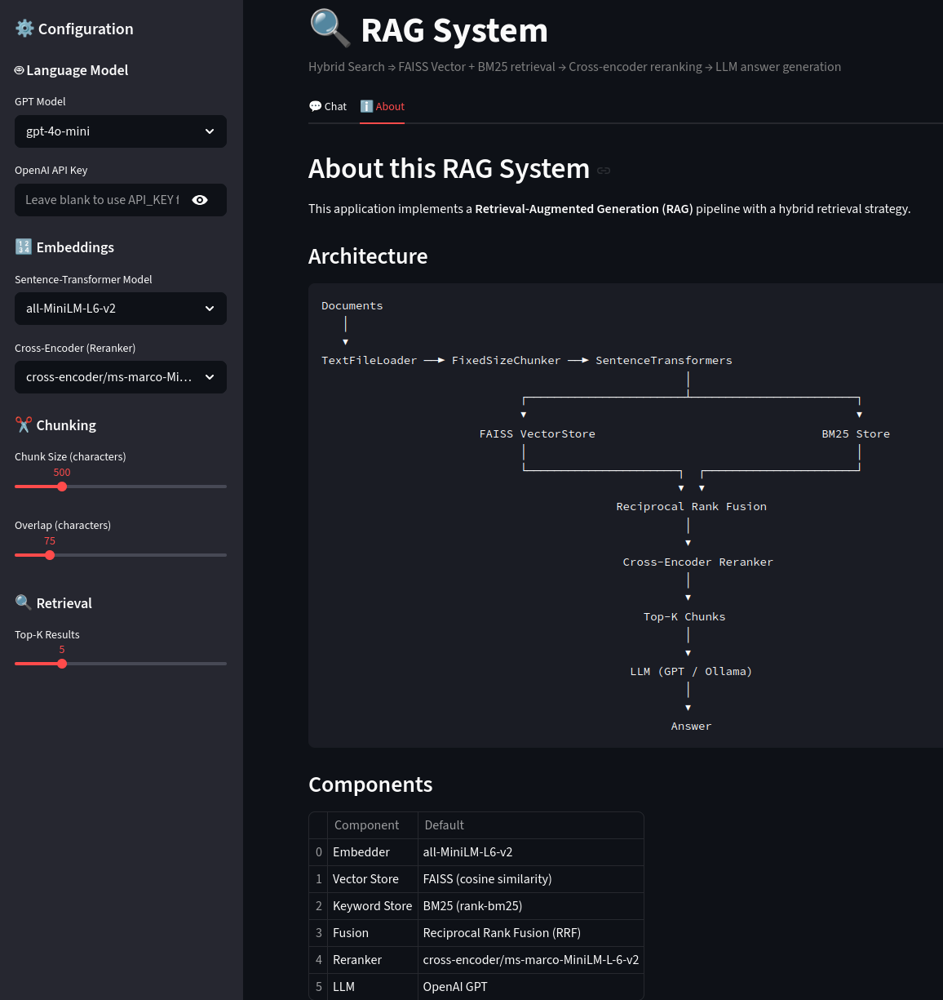

# RAG System

A modular Retrieval-Augmented Generation system that combines dense vector search (FAISS), sparse keyword search (BM25), and cross-encoder reranking to deliver grounded, context-aware answers from your documents.  

Streamlit app: https://rag-system-32.streamlit.app/

## Architecture

```
                      Documents (.txt)
                          │
                          ▼
┌──────────────────────────────────────────────────┐
│              Ingestion Pipeline                  │
│  TextFileLoader → FixedSizeChunker → Embedder    │
│         │                    │                   │
│         ▼                    ▼                   │
│    BM25 Store         FAISS VectorStore          │
│   (in-memory)        (disk-persisted + SQLite)   │
└──────────────────────────────────────────────────┘

                      User Query
                          │
                          ▼
┌──────────────────────────────────────────────────┐
│              Hybrid Retriever                    │
│  1. FAISS dense search     ──┐                   │
│  2. BM25 keyword search    ──┤→ Reciprocal Rank  │
│                              │  Fusion (RRF)     │
│  3. Cross-Encoder Reranker ◄─┘                   │
│  4. Top-k ScoredChunks                           │
└──────────────────────────────────────────────────┘
                          │
                          ▼
┌──────────────────────────────────────────────────┐
│            Generation Pipeline                   │
│  Prompt formatting → LLM → Answer + Sources      │
└──────────────────────────────────────────────────┘
```

## Features

- **Hybrid retrieval** — merges semantic (FAISS) and lexical (BM25) signals via Reciprocal Rank Fusion
- **Cross-encoder reranking** — rescores candidates with a cross-encoder for higher precision
- **Incremental ingestion** — SHA-256 content hashing skips unchanged documents and re-indexes modified ones
- **Configurable components** — swap chunkers, embedders, LLM backends, and retrieval parameters
- **Interactive UI** — Streamlit app with document upload, configurable settings, and chat with source inspection
- **CLI mode** — `main.py` for scripted or terminal-based usage
- **RAGAS evaluation** (to be added) — built-in evaluation pipeline for faithfulness, answer relevancy, and context precision

## Requirements

- Python >= 3.12
- An OpenAI API key (for GPT-based generation) **or** a local [Ollama](https://ollama.com/) instance

## Installation

```bash
# uv

git clone https://github.com/bahakarakaya/rag-system
cd rag-system
uv sync
source .venv/bin/activate

--or--

# pip

git clone https://github.com/bahakarakaya/rag-system
cd rag-system
python -m venv .venv
source .venv/bin/activate
pip install -e .
```

Create a `.env` file in the project root:

```env
OPENAI_API_KEY=your-api-key-here
LOG_LEVEL=INFO    # DEBUG, INFO, WARNING, ERROR
```

## Usage

### Streamlit App

```bash
streamlit run streamlit_app.py
```

The sidebar lets you configure:

| Setting | Options |
|---|---|
| **GPT Model** | gpt-4o-mini, gpt-3.5-turbo |
| **Embedding Model** | all-MiniLM-L6-v2 (384d), all-mpnet-base-v2 (768d), all-distilroberta-v1 (768d) |
| **Cross-Encoder** | ms-marco-MiniLM-L-6-v2, ms-marco-TinyBERT-L-2-v2 |
| **Chunk Size** | 100–2000 characters (default 500) |
| **Chunk Overlap** | 0–500 characters (default 75) |
| **Top-k** | 1–20 (default 5) |

Upload `.txt` files in the **Ingest Documents** tab, then switch to **Chat** to ask questions.




### CLI

```bash
python main.py
```

Place your `.txt` documents in the `data/` directory. The script ingests them, then prompts for a query.

## Project Structure

```
rag/
  core/
    interfaces.py       # Abstract base classes (Chunker, Embedder, VectorStore, Llm)
    models.py            # Data models (Document, Chunk, EmbeddedChunk, ScoredChunk)
  ingestion/
    loaders/text.py      # TextFileLoader
    chunkers/fixed.py    # FixedSizeChunker (character-based with overlap)
    embedders/
      sentence_trans.py  # SentenceTransformersEmbedder
  stores/
    faiss.py             # FAISS vector store with SQLite metadata persistence
    bm25.py              # BM25 keyword store (rank-bm25 + NLTK tokenization)
    hybrid.py            # HybridRetriever (RRF fusion of FAISS + BM25)
  generation/
    gpt.py               # OpenAI GPT client
    ollama.py            # Local Ollama client
  pipeline/
    ingestion.py         # IngestionPipeline (load → chunk → embed → store)
    query.py             # QueryPipeline (query → hybrid retrieve)
    generation.py        # GenerationPipeline (retrieve → prompt → LLM)
    reranker.py          # CrossEncoderReranker
    evaluation.py        # RAGAS evaluation pipeline
utils/
  db.py                  # SQLite metadata manager
  hashing.py             # SHA-256 content hashing
main.py                  # CLI entry point
streamlit_app.py         # Streamlit web UI
```

## How It Works

1. **Ingestion** — Documents are loaded, split into fixed-size character chunks (with overlap), embedded via sentence-transformers, and stored in both a FAISS index and an in-memory BM25 index. Metadata is persisted in SQLite. Content hashes enable incremental updates.

2. **Retrieval** — A user query is embedded and run against FAISS (dense) and BM25 (sparse) in parallel. Results are merged via Reciprocal Rank Fusion (k=60), then the top candidates are rescored by a cross-encoder model.

3. **Generation** — Retrieved chunks are injected into a prompt template and sent to the configured LLM. The system prompt constrains answers to the provided context only, preventing hallucination.